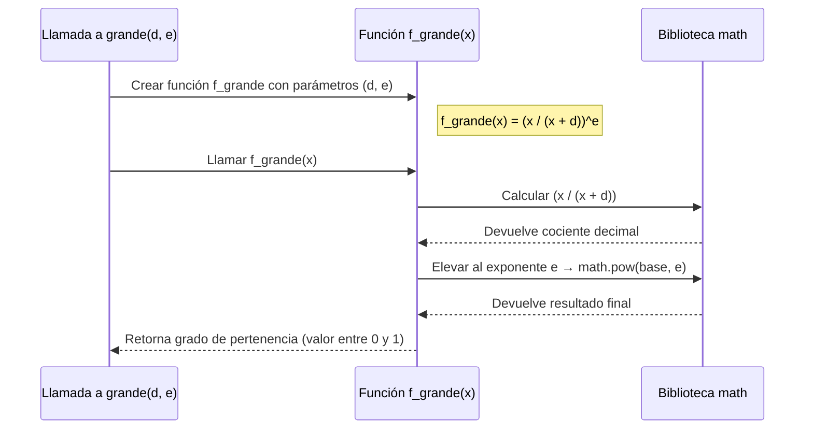
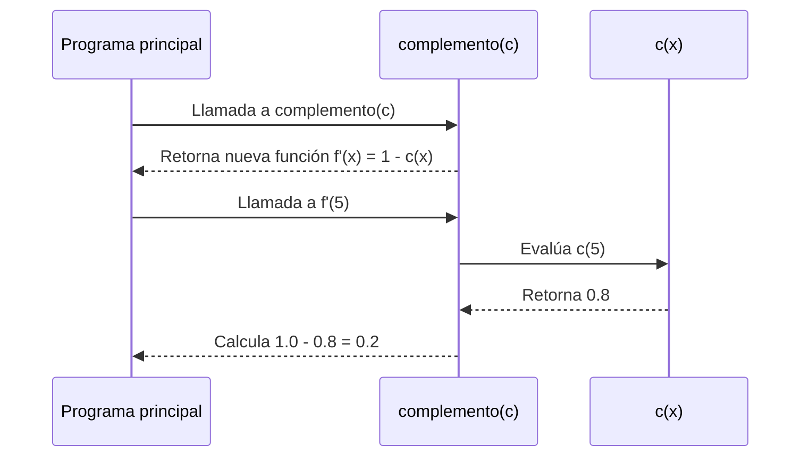
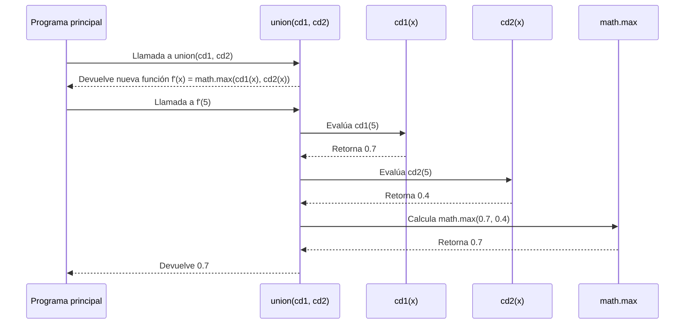
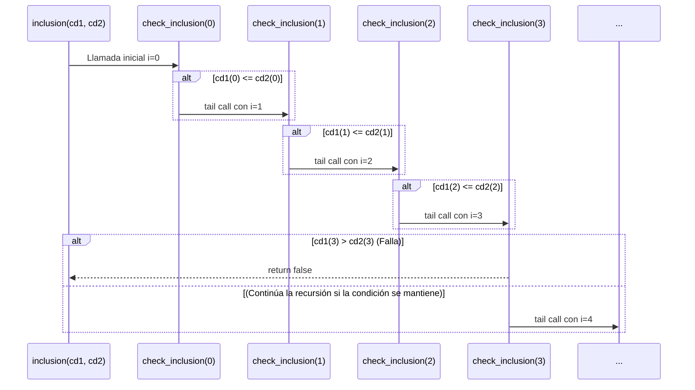
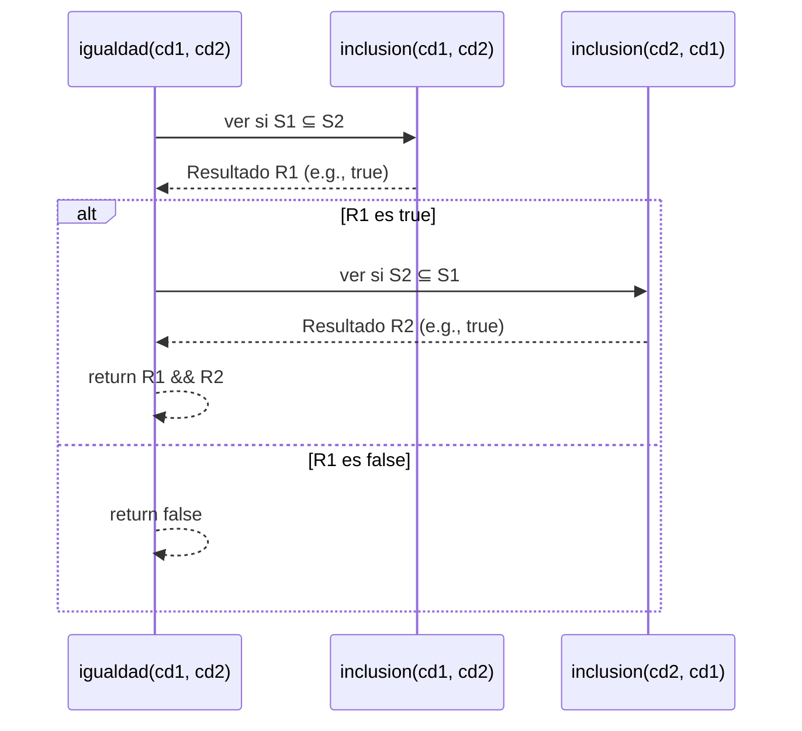

#Informe de Proceso

**Fundamentos de programación funcional y concurrente**

Documento realizado por: Mariana Viera - Nathalie Wilches

---

## 1. Introducción y requisitos de proceso

Este informe detalla el proceso de ejecución de las funciones implementadas para conjuntos difusos, centrándose en explicar claramente el flujo y, para los algoritmos recursivos, mostrando el estado de la pila de llamados.

El tipo `ConjDifuso` se define como `Int => Double`.

---

## 2. Funciones de alto orden

Las siguientes funciones son de alto orden y actúan como traducciones directas de la especificación matemática.

### 2.1. Conjunto difuso de números grandes (`grande`)

**Especificación ($f_{grande}$):**
El grado de pertenencia se define mediante la fórmula:

$$f_{grande}(x) = \left(\frac{x}{x + d}\right)^e$$

donde $d \ge 1$ y $e > 1$.

**Scala:**

```scala
def grande(d: Int, e: Int): Int => Double = {
  x => math.pow(x.toDouble / (x + d).toDouble, e.toDouble)
}
```

**Explicación del proceso de ejecución:**

La función `grande` es una función de alto orden que devuelve otra función anónima (`Int => Double`). Cuando esta función devuelta se llama con un valor $x$:

1.  Se realiza la división $x / (x+d)$, asegurando que los valores son de tipo `Double`.
2.  El resultado de la base se eleva al exponente $e$ usando `math.pow`.
3.  El resultado es el grado de pertenencia, garantizado a estar en el intervalo $[0.0, 1.0]$.

**Diagrama de secuencia**


**Diagrama de secuencia: explicación**
- `Main`: el programa principal que llama a la función `grande`.
- `f_grande`: la **función generada** (la que calcula el valor cuando le das un número `x`).
- `Math`: la biblioteca de Scala usada para las operaciones matemáticas (`math.pow` y divisiones).
---
### 2.2. Complemento (`complemento`)

**Especificación ($f_{\neg S}$):**
El valor complementario se calcula como $f_{\neg S}(x) = 1 - f_{S}(x)$.

**Programa en Scala:**

```scala
def complemento(c: Int => Double): Int => Double = {
  x => 1.0 - c(x)
}
```

**Explicación del proceso de ejecución:**

La implementación es una traducción directa de la especificación. La función toma un conjunto difuso $c$ (que es una función) y devuelve una nueva función que, para cualquier entrada $x$, calcula el grado de pertenencia original $c(x)$ y lo resta de 1.0.

**Diagrama de secuencia**


**Diagrama de secuencia: explicación**
- `Main` → Representa el programa principal, donde se invoca la función complemento.
- `F` → Es la función generada por complemento, que define cómo calcular el complemento de un conjunto difuso.
- `C` → Representa la función original c(x) que devuelve el grado de pertenencia del conjunto difuso inicial.
---

### 2.3. Unión (`union`)

**Especificación ($f_{S_1 \cup S_2}$):**
La unión toma el valor máximo entre los grados de pertenencia: $f_{S_1 \cup S_2} = \max(f_{S_1}, f_{S_2})$.

**Programa en Scala:**

```scala
def union(cd1: Int => Double, cd2: Int => Double): Int => Double = {
  x => math.max(cd1(x), cd2(x))
}
```

**Explicación del proceso de ejecución:**

La función utiliza `math.max` para encontrar el valor mayor entre los grados de pertenencia de los dos conjuntos, $cd1(x)$ y $cd2(x)$, implementando directamente la operación de la especificación.

**Diagrama de secuencia**


**Diagrama de secuencia: explicación**
- `Main` → Representa el programa principal, donde se llama a la función union.
- `F` → Es la función generada por union(cd1, cd2), que define cómo combinar los conjuntos difusos.
- `CD1` y `CD2` → Representan los conjuntos difusos originales, cada uno devuelve su grado de pertenencia.

---

### 2.4. Intersección (`interseccion`)

**Especificación ($f_{S_1 \cap S_2}$):**
La intersección toma el valor mínimo entre los grados de pertenencia: $f_{S_1 \cap S_2} = \min(f_{S_1}, f_{S_2})$.

**Programa en Scala:**

```scala
def interseccion(cd1: Int => Double, cd2: Int => Double): Int => Double = {
  x => math.min(cd1(x), cd2(x))
}
```

**Explicación del proceso de ejecución**

La función utiliza `math.min` para encontrar el valor menor entre los grados de pertenencia de los dos conjuntos, $cd1(x)$ y $cd2(x)$, implementando directamente la operación de la especificación.

---

## 3. Funciones Relacionales (Recursión de Cola)

### 3.1. Inclusión (`inclusion`)

**Especificación ($f_{inclusion}$):**
$S_1 \subseteq S_2$ si y solo si $\forall x \in U: f_{S_1}(x) \le f_{S_2}(x)$. La búsqueda se limita al intervalo

**Programa en Scala:**

```scala
def inclusion(cd1: ConjDifuso, cd2: ConjDifuso): Boolean = {
  def inclusion(i: Int): Boolean = {
    if (i > 1000) {
      true
    } else if (cd1(i) <= cd2(i)) {
      check_inclusion(i + 1)
    } else {
      false
    }
  }
  check_inclusion(0)
}
```

**Argumentación del proceso de ejecución:**

1.  **Estado Inicial:** La iteración comienza con el índice $i=0$. El estado inicial es $s_0 = (0)$.
2.  **Invariante (Implícito en el proceso):** Se asume que para todos los valores revisados $k \in [0, i-1]$, la inclusión ha sido cierta.
3.  **Llamada Recursiva:** Si $cd1(i) \le cd2(i)$, el estado se transforma a $s \to (i+1)$ mediante la llamada recursiva de cola `check_inclusion(i + 1)`.
4.  **Caso Base**
    *   Si $i$ supera el límite superior de búsqueda (1000), la función termina devolviendo `true` (la inclusión se verifica para el universo limitado).
    *   Si $cd1(i) > cd2(i)$, la condición de inclusión falla, y la función termina inmediatamente devolviendo `false`.

**Pila de Llamados con Recursión de Cola**

Dado que se utiliza **recursión de cola**  la llamada recursiva es la **última instrucción**. El compilador transforma esto en un **bucle optimizado**, lo que significa que **no se acumulan marcos de llamada en la pila de ejecución**.

A continuación, se muestra una traza conceptual para un caso donde la inclusión se verifica solo hasta $i=3$ y luego falla (asumiendo $cd1(3) > cd2(3)$):



### 3.2. Igualdad (`igualdad`)

**Especificación ($f_{igualdad}$):**
Dos conjuntos son iguales si hay inclusión mutua: $S_1 = S_2 \iff (S_1 \subseteq S_2 \land S_2 \subseteq S_1)$.

**Programa en Scala:**

```scala
def igualdad(cd1: ConjDifuso, cd2: ConjDifuso): Boolean = {
  inclusion(cd1, cd2) && inclusion(cd2, cd1)
}
```

**Explicación del Proceso de ejecución:**

La corrección de $P_{igualdad}$ se basa en la doble aplicación de la función `inclusion`.

1.  **Primer chequeo:** Se evalúa `inclusion(cd1, cd2)`. Si este resultado es `false`, la función `igualdad` termina inmediatamente devolviendo `false` debido al operador `&&` (cortocircuito lógico).
2.  **Segundo chequeo:** Si el primer chequeo es `true`, se evalúa `inclusion(cd2, cd1)`. El resultado final de esta segunda llamada determina el resultado de `igualdad`.

**Pila de Llamados**

El diagrama muestra la dependencia de la `igualdad` en la ejecución secuencial de `inclusion` (la cual internamente es una recursión de cola).


---
